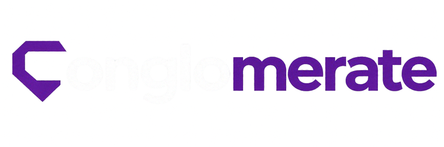
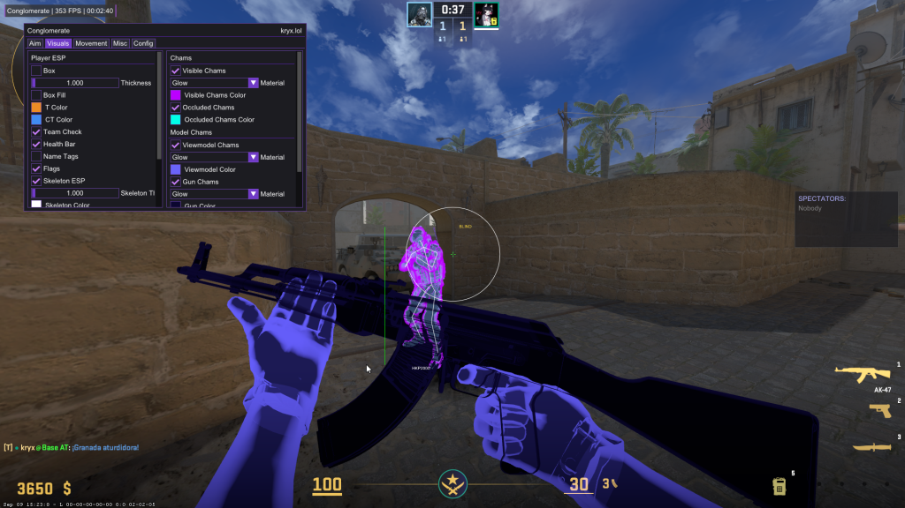

    
  </a>

 

  
  
  
  </a>
  
  

---
### Conglomerate is a free C++-based internal for Counter-Strike 2. Based on <a href="https://github.com/TempleDevelopment/TempleWare-Public">Templeware-Public.</a>
---

### How to Launch Conglomerate

1. **Build the DLL:**
   - Open the project in Visual Studio.
   - Set the build configuration to **Release x64**.
   - Build the solution (`Build` > `Build Solution`).

2. **Inject the DLL:**
   - Find the `Conglomerate.dll` in the `\Release\x64\` folder.
   - Use a DLL injector (e.g., [Extreme Injector](https://github.com/master131/ExtremeInjector/releases)) to inject `Conglomerate.dll` into `cs2.exe`.

3. **Play CS2:**
   - Launch `Counter-Strike 2` and start using Conglomerate.
   - Menu Bind `INS`

---

## Showcase

    
  </a>

 

---

  <b>Why conglomerate?</b>

Conglomerate its a <a href="https://github.com/TempleDevelopment/TempleWare-Public">TempleWare-Based</a> cheat, the original Templeware source code was beyond broken so a lot of things had to be fixed. This was possible thanks to a collection of AI source code, <a href="https://www.unknowncheats.me/forum/counter-strike-2-a/757633-updated-templeware-internal.html">UnknownCheats fixes</a>, Own source code and other leaked cheats source codes, making this cheat as the name indicates, a conglomerate of slop (the original name was Slopware).
